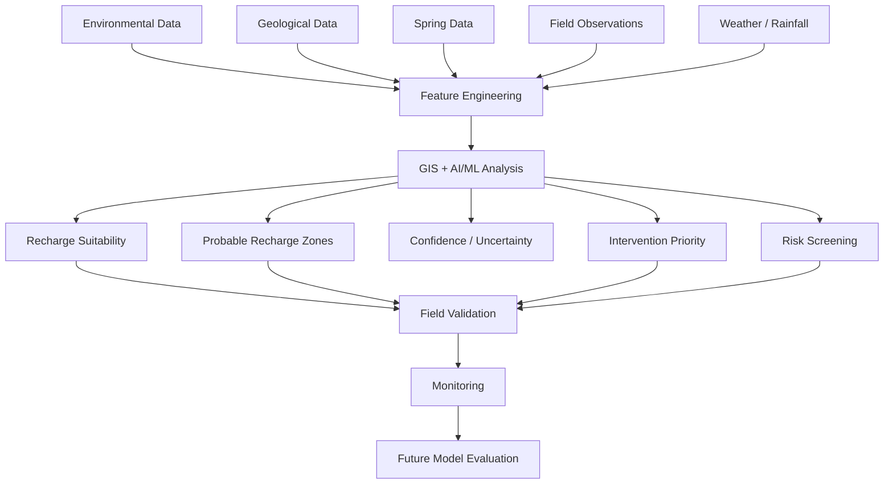
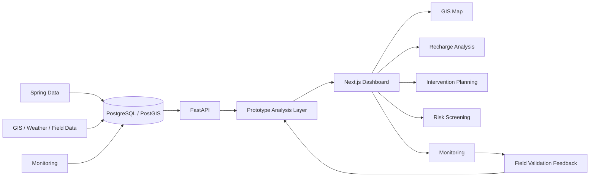

# SPRINGVYRA
### AI-Assisted Geospatial Spring-Recharge Decision-Support System

[](frontend/package.json)
[](backend/requirements.txt)
[](docker-compose.yml)
[](frontend/package.json)

SPRINGVYRA is a Smart India Hackathon 2026 prototype for SIH26240, **AI-Based Spring Revival and Recharge Planning for Tribal Areas**. It combines spring records, GIS map layers, environmental and hydrogeological metadata, field observations, monitoring measurements, weather status, and transparent prototype analysis to support probable recharge-zone identification and spring-revival planning.

SPRINGVYRA is decision support. It does not determine groundwater truth.

## 🎯 SIH26240 — Problem Statement

Springs are critical water sources for mountain and tribal communities, but their recharge areas are difficult to identify from isolated field observations. Recharge potential depends on interacting terrain, geology, rainfall, drainage, land use, spring characteristics, and field evidence.

A practical geospatial decision-support platform should bring these datasets together, expose data quality and uncertainty, help identify **probable** recharge zones, and support the selection and field validation of possible interventions. The final decision must remain with qualified practitioners and local stakeholders.

## 💡 Our Solution

SPRINGVYRA follows this workflow:

```text
OBSERVE → COLLECT DATA → ANALYSE → IDENTIFY PROBABLE RECHARGE ZONES
→ PRIORITISE INTERVENTIONS → FIELD VALIDATE → MONITOR → IMPROVE
```

The current system connects spring data, spatial geometry, field observations, monitoring measurements, provenance metadata, weather integration, a controlled read-only assistant, and a transparent prototype suitability layer. Authoritative raster and geological analysis are designed as the next stage rather than being fabricated in the prototype.

## 🎯 Objectives

1. Manage spring locations and characteristics.
2. Visualise springs and supplied spatial information through GIS.
3. Integrate environmental and hydrogeological dataset metadata.
4. Support probable recharge-zone identification.
5. Support intervention-site planning and ranking.
6. Capture field observations and GPS information.
7. Monitor discharge, water level, and pH.
8. Maintain dataset provenance.
9. Provide controlled, read-only decision-support information.
10. Support English, Hindi, Nepali, and Kannada labels where translations are currently wired.
11. Keep uncertainty, missing data, and field-validation requirements visible.

## ✅ Current Implementation

The repository currently includes:

- FastAPI backend with SQLAlchemy and PostgreSQL/PostGIS models.
- Next.js 14 and React 18 dashboard.
- Spring CRUD with coordinates, elevation, type, discharge, pH, status, provenance status, and optional description/catchment.
- Spring and field-observation point storage as EPSG:4326 geometry.
- Recharge-zone records with optional EPSG:4326 `MultiPolygon` geometry.
- Field-observation CRUD with observer, GPS coordinates, vegetation, land use, discharge, water level, notes, photo URL, and validation state.
- Validation states: `PENDING`, `VALIDATED`, `REJECTED`, and `NEEDS_REVIEW`.
- Monitoring measurement entry for discharge, water level, pH, observer, notes, and timestamps.
- Monitoring spring profile and CSS-based historical trend charts.
- Intervention candidate entry and prototype priority ranking.
- Prototype risk screening with explanations and explicit limitations.
- Interactive Leaflet map with OpenStreetMap and Esri satellite base layers, spring popups, supplied recharge polygons, zoom, scale, and layer controls.
- Dashboard overview and spring inventory.
- Dataset provenance entry for source, acquisition date, resolution, license, and processing method.
- OpenWeatherMap-backed weather endpoint when `WEATHER_API_KEY` is configured.
- GIS readiness endpoint that identifies missing environmental inputs.
- Transparent prototype suitability analysis with factors, confidence, completeness, uncertainty, and layer readiness.
- Structured JSON watershed assessment report endpoint and dashboard JSON export.
- Controlled, allow-listed, read-only data assistant.
- English, Hindi, Nepali, and Kannada language selector with browser persistence.
- Docker Compose development stack for PostGIS, FastAPI, and the Next.js production container.
- Synthetic seed data, explicitly marked `DEMO`.

## 🛡️ Scientific & Data Safeguards

> **SPRINGVYRA is a decision-support prototype and does not determine groundwater truth.**

- Seeded spring, zone, observation, and monitoring values are synthetic `DEMO DATA`.
- Demo values are not real field observations, government data, authoritative groundwater information, or validated model outputs.
- Prototype suitability, confidence, completeness, and risk values are demonstrative and are not scientific accuracy claims.
- Authoritative GIS inputs are not bundled. Missing layers are shown as unavailable or not configured.
- Future predictions require sourced environmental datasets, quality checks, model validation, uncertainty evaluation, field validation, and expert hydrogeological review.
- Intervention candidates are not construction approvals.
- The controlled assistant only reports available application data and cannot write to the database or invent predictions.

> ⚠️ SPRINGVYRA does not replace hydrogeological surveys, field validation, engineering assessment, or expert judgement.

## 🧠 Recharge Analysis

### Current state

The current implementation includes:

- `GET /api/recharge/readiness` for required-input and source-catalog readiness.
- `POST /api/recharge/analyze`, which remains blocked when authoritative spatial inputs are unavailable.
- Prototype analysis endpoints for transparent demonstration output.
- Prototype suitability factors including elevation, slope, drainage, rainfall, geology, fracture density, land use, and spring discharge.
- Prototype values for suitability, confidence, data completeness, and uncertainty.
- Explicit field-validation requirements and a model feedback-loop representation.

The prototype does **not** contain a trained or scientifically validated ML model. It must not claim model accuracy.

### Intended future inputs

- DEM/elevation, slope, and aspect
- Drainage density, runoff, and rainfall
- Geology, rock type, contacts, faults, fractures, joints, and strike/dip where available
- Land use/land cover and soil
- Spring discharge, spring type, and distance to drainage or geological contacts
- Existing recharge structures and field observations

### Intended future outputs

- Recharge suitability and probable recharge zones
- Confidence and uncertainty
- Intervention priority
- Risk and unsuitable-location screening

These outputs remain planned or prototype capabilities until authoritative layers and validated modelling are connected.

## 🤖 AI/ML Architecture



**Repository status:** partially implemented. The data entities, API contracts, transparent prototype analysis, field workflow, and monitoring feedback representation exist. Feature engineering over authoritative spatial layers, training data, trained ML, spatial validation, uncertainty calibration, and automatic retraining are planned.

## 🔄 System Workflow



## 🏗️ System Architecture

- **Frontend:** Next.js 14, React 18, React Leaflet, Leaflet, Lucide icons, and CSS/Tailwind tooling.
- **Backend:** FastAPI with Pydantic request validation and SQLAlchemy ORM.
- **Database:** PostgreSQL with PostGIS geometry support.
- **GIS layer:** Leaflet map with OpenStreetMap and Esri satellite base layers; supplied spring points and recharge polygons are rendered.
- **Analysis layer:** GIS readiness checks, transparent prototype suitability/risk/priority outputs, and future ML integration points.
- **Field workflow:** GPS-enabled field observation form, validation states, intervention candidate records, and monitoring measurements.
- **Feedback:** Field and monitoring data are represented as future model-evaluation inputs; automatic retraining is not active.

## ✨ Key Features

| Feature | Purpose | Status |
|---|---|---|
| Spring Network | Manage spring records and characteristics | Implemented |
| Interactive GIS Map | View springs, supplied polygons, and base layers | Implemented |
| Recharge Zones | Store and render optional MultiPolygon boundaries | Implemented |
| Field Observations | Capture observer, GPS, measurements, notes, and validation | Implemented |
| GPS Capture | Capture device location in the field form | Implemented |
| Monitoring | Store measurements, profiles, and trend charts | Prototype |
| Intervention Planning | Store candidates and show prototype priorities | Prototype |
| Risk Analysis | Show transparent prototype screening and explanations | Prototype |
| Weather Data | OpenWeatherMap current-weather integration | Partially Implemented |
| Data Provenance | Record source and quality metadata | Implemented |
| AI/Data Assistant | Allow-listed read-only application-data lookup | Implemented |
| Multilingual Support | English, Hindi, Nepali, Kannada labels currently wired | Partial |
| Recharge AI/ML | Transparent prototype outputs; no validated ML | Prototype |
| Reports | Structured JSON assessment and dashboard JSON export | Prototype |

## 🧭 SPRINGVYRA Modules

The dashboard currently exposes:

- **Overview:** spring counts, status, map, inventory, source readiness, and data status.
- **Map:** Leaflet map with spring points, supplied recharge polygons, OpenStreetMap, satellite imagery, zoom, scale, and popups.
- **Spring Network:** spring inventory and existing CRUD workflow.
- **Recharge Analysis:** prototype score, confidence, completeness, uncertainty, factors, layer readiness, zones, and feedback loop.
- **Intervention Planning:** prototype priority table plus candidate-entry form.
- **Risk Analysis:** prototype risk-screening records and explanations.
- **Field Observations:** GPS-enabled observation form and validation workflow.
- **Monitoring:** spring profile, trend charts, measurement entry, and stored measurements.
- **Reports:** report-status endpoint and structured assessment data; PDF generation is not configured.
- **Data Sources:** provenance metadata form and source list.
- **Catchment Explorer:** visible prototype placeholder; authoritative catchment boundaries are not supplied.
- **Weather Data:** provider status and current-weather information.
- **Ask SpringVyra:** controlled read-only assistant for stored records and configured sources.

## 🗺️ GIS & Spatial Analysis

### Current

- Spring points and field-observation points use EPSG:4326 geometry.
- Recharge zones accept optional Polygon/MultiPolygon GeoJSON and store MultiPolygon geometry.
- Leaflet renders spring markers and supplied recharge polygons.
- OpenStreetMap and Esri satellite imagery are available as base layers.
- GIS readiness checks report missing DEM, slope/aspect, rainfall, geology, soil, land-cover, and drainage inputs.

### Planned

- DEM processing and derived slope/aspect.
- Drainage and runoff layers.
- Geological, fault, fracture, and contact overlays.
- Rainfall and land-use/land-cover layers.
- Raster suitability analysis and authoritative risk screening.

See [docs/gis-pipeline.md](docs/gis-pipeline.md).

## 📚 Data Provenance

The data-source catalog records:

- Dataset/source name
- Acquisition date
- Spatial resolution
- License
- Processing method
- Data status

Temporal resolution, CRS, coverage, and quality metadata should be added as the source catalog expands. Traceability and reproducibility are required before using external layers for analysis.

## 🗄️ Database

PostgreSQL/PostGIS stores:

- `springs`
- `recharge_zones`
- `field_observations`
- `spring_measurements`
- `intervention_sites`
- `data_sources`
- Model, weather, rainfall, and sensor tables defined for future expansion

Spring and observation locations are EPSG:4326 `POINT` geometries. Recharge-zone boundaries are optional EPSG:4326 `MULTIPOLYGON` geometries. Foreign keys connect observations and measurements to springs.

See [docs/database.md](docs/database.md).

## 🔌 API

The FastAPI service runs on port `8000` by default. Open `/docs` for generated OpenAPI documentation.

| Method | Endpoint | Purpose |
|---|---|---|
| GET | `/health`, `/api/health` | Service health |
| GET/POST/PUT/DELETE | `/api/springs`, `/api/springs/{id}` | Spring CRUD |
| GET/POST/PUT/DELETE | `/api/recharge-zones`, `/api/recharge-zones/{id}` | Recharge-zone CRUD |
| GET | `/api/recharge/zones` | GeoJSON zone FeatureCollection |
| GET/POST/PUT/DELETE | `/api/observations`, `/api/observations/{id}` | Field-observation CRUD |
| GET/POST/PUT/DELETE | `/api/field-observations`, `/api/field-observations/{id}` | Compatibility aliases |
| GET | `/api/dashboard`, `/api/dashboard/summary` | Dashboard metrics and completeness summary |
| GET | `/api/weather` | Current weather provider status/data |
| GET | `/api/recharge/readiness` | Required-source readiness |
| POST | `/api/recharge/analyze` | Blocked analysis response when authoritative inputs are missing |
| GET | `/api/recharge/analysis`, `/api/recharge/suitability` | Prototype suitability output |
| GET/POST | `/api/monitoring` | Monitoring list and measurement creation |
| GET/POST | `/api/interventions` | Candidate records |
| GET | `/api/interventions/priorities` | Prototype intervention ranking |
| GET | `/api/risk-analysis`, `/api/risks` | Risk status and prototype screening |
| GET | `/api/model/predictions` | Explicit model status; no trained model active |
| GET | `/api/model/feedback` | Feedback-loop representation |
| GET | `/api/reports/status`, `/api/reports/summary` | Report availability and structured report |
| GET/POST | `/api/data-sources` | Provenance metadata |
| POST | `/api/assistant/query` | Bounded read-only assistant lookup |

## 🧪 Demo Data

`seed.py` creates synthetic records for development and demonstration:

- 8 springs
- 4 recharge-zone records
- Synthetic field observations
- Synthetic Jal Dhara monitoring history for trend display

The records are marked `DEMO`. They are not government data, field-verified data, authoritative groundwater information, or validated model outputs. Do not use them to select or approve a real intervention.

## ⚙️ Requirements

- Python `3.12` is used by the backend Dockerfile; Python 3.10+ language features are used in source code.
- Node.js 20 is used by the frontend Dockerfile; Node.js 18+ is suitable for the checked-in Next.js 14 application.
- npm and network access for dependency installation and external map/weather requests.
- PostgreSQL with PostGIS for local native development, or Docker Desktop for the Compose workflow.

## 🚀 Getting Started — Windows PowerShell

### Native backend

From the repository root:

```powershell
py -m venv .venv
.\.venv\Scripts\Activate.ps1
python -m pip install -r backend/requirements.txt
if (-not (Test-Path .env)) { Copy-Item .env.example .env }
notepad .env
python seed.py
python -m uvicorn backend.main:app --reload --host 127.0.0.1 --port 8000
```

Set `DATABASE_URL` to a PostgreSQL/PostGIS database you control. Do not commit `.env` or real credentials. Keep the backend terminal open.

### Native frontend

In a second PowerShell window:

```powershell
cd frontend
npm.cmd install
if (-not (Test-Path .env.local)) { Copy-Item .env.example .env.local }
npm.cmd run dev
```

Open [http://localhost:3000](http://localhost:3000). The browser-visible API URL is controlled by `frontend/.env.local`.

For a stable production-style local server, use:

```powershell
npm.cmd run build
npm.cmd run start
```

## 🐳 Docker

The Compose file defines:

- `db`: `postgis/postgis:16-3.4`, host port `5432`
- `backend`: FastAPI, host port `8000`
- `frontend`: Next.js production container, host port `3000`

Configure `POSTGRES_PASSWORD` in `.env`, then run from the repository root:

```powershell
docker compose up --build
```

The backend container seeds the database before starting. This stack is for local development and demonstration.

## 🔐 Environment Variables

| Variable | Purpose | Required/Optional |
|---|---|---|
| `DATABASE_URL` | SQLAlchemy PostgreSQL/PostGIS connection URL | Required for native backend |
| `CORS_ORIGINS` | Comma-separated browser origins allowed by FastAPI | Required for browser API calls |
| `NEXT_PUBLIC_API_URL` | Browser-visible FastAPI base URL | Required for frontend deployment/local override |
| `POSTGRES_DB` | Compose database name | Optional; default in Compose |
| `POSTGRES_USER` | Compose database user | Optional; default in Compose |
| `POSTGRES_PASSWORD` | Compose database password | Required by Compose |
| `WEATHER_API_KEY` | OpenWeatherMap provider key used server-side | Optional; weather remains not configured without it |
| `LLM_API_KEY` | Reserved for future LLM integration; not currently consumed | Optional/unused |
| `JWT_SECRET` | Reserved for future authentication | Optional/unused |

Never place provider secrets in `NEXT_PUBLIC_*` variables. Rotate any key exposed in chat, logs, or source control.

## 🧪 Testing

Install development dependencies and run the API contract tests:

```powershell
.\.venv\Scripts\Activate.ps1
python -m pip install -r backend/requirements-dev.txt
python -m pytest
```

Build the frontend from `frontend`:

```powershell
npm.cmd run build
```

The repository contains API contract tests for health, CORS, weather/readiness safeguards, and blocked analysis behavior. Some assertions describe the original unconfigured-weather fixture and should be updated when running with a live provider key.

## 📁 Project Structure

```text
SPRINGVYRA/
├── backend/
│   ├── database.py
│   ├── Dockerfile
│   ├── main.py
│   ├── migrations.py
│   ├── models.py
│   ├── requirements.txt
│   ├── requirements-dev.txt
│   └── schemas.py
├── frontend/
│   ├── Dockerfile
│   ├── package.json
│   ├── public/
│   └── src/
│       ├── app/
│       └── components/
├── docs/
├── tests/
│   └── test_api_contract.py
├── docker-compose.yml
├── seed.py
├── .env.example
├── .gitignore
└── README.md
```

## 🏆 SIH26240 Alignment

| SIH26240 Requirement | SPRINGVYRA Implementation | Status |
|---|---|---|
| Spring inventory | Spring CRUD and dashboard inventory | Implemented |
| Location/elevation/discharge | Spring fields and EPSG:4326 points | Implemented |
| GIS visualisation | Leaflet map, OSM, satellite, popups | Implemented |
| DEM | Readiness placeholder only | Not Configured |
| Slope/aspect | Readiness placeholder only | Not Configured |
| Drainage/runoff | Readiness placeholder only | Not Configured |
| Rainfall | OpenWeather current-weather integration | Partial |
| Geology/rock type/contacts | No authoritative layer connected | Not Configured |
| Faults/fractures/joints | Prototype factor label only | Planned |
| Land use/land cover | Readiness placeholder only | Not Configured |
| Existing recharge structures | Intervention candidate records | Partial |
| Field observations | GPS form, measurements, notes, validation states | Implemented |
| Recharge-zone delineation | Records and supplied polygon rendering | Partial |
| Suitability/probability | Transparent prototype output | Prototype |
| Confidence/uncertainty | Prototype fields and disclaimers | Prototype |
| Intervention prioritisation | Prototype ranking endpoint/table | Prototype |
| Intervention recommendation | Candidate workflow and prototype recommendations | Prototype |
| Risk/unsuitable locations | Prototype screening endpoint/table | Prototype |
| GIS layers | Springs, supplied zones, OSM, satellite | Partial |
| Field validation | Pending/review states and form | Implemented |
| Monitoring | Measurements, profile, trends | Prototype |
| Feedback to future model | Feedback endpoint and UI representation | Prototype |

## 🛣️ Roadmap

### Phase 1 — Prototype

- Spring management
- GIS map and supplied geometry
- Field observations and GPS capture
- Monitoring measurements and trend display
- Intervention records
- Data provenance
- Controlled assistant

### Phase 2 — GIS Intelligence

- DEM and derived slope/aspect
- Drainage and runoff
- Geology, contacts, faults, and fractures
- Rainfall history
- Land use/land cover
- Authoritative spatial overlays

### Phase 3 — AI/ML

- Training dataset and feature engineering
- Recharge suitability model
- Spatial validation
- Uncertainty estimation
- Model evaluation and reproducible versioning

### Phase 4 — Field Validation

- Confirm/reject/needs-review workflow improvements
- Monitoring feedback
- Evaluation against field observations

### Phase 5 — Production

- Authentication/RBAC
- Complete multilingual UI and voice interaction
- PDF reports and media storage
- Cloud deployment
- Security and operational hardening

## 🔒 Security

- Secrets are loaded from environment files and excluded by `.gitignore`.
- Browser configuration uses `NEXT_PUBLIC_API_URL`; provider secrets remain backend-only.
- FastAPI validates request payloads through Pydantic.
- CORS is explicitly configured for local origins.
- The assistant uses allow-listed lookups and does not execute arbitrary SQL or mutate data.
- Authentication and role-based access control are not implemented.
- The current stack is a local prototype and is not hardened for untrusted public exposure.

## 📖 Documentation

- [Architecture and implementation status](docs/architecture.md)
- [Database](docs/database.md)
- [GIS pipeline](docs/gis-pipeline.md)
- [ML validation requirements](docs/ml-pipeline.md)
- [API notes](docs/api.md)
- [Deployment](docs/deployment.md)
- [User guide](docs/user-guide.md)

## 🤝 Contributing

1. Fork the repository.
2. Create a focused branch.
3. Make a scoped change consistent with the current architecture.
4. Run backend tests and the frontend build.
5. Open a pull request describing data, API, and scientific-safeguard implications.

## 📄 License

License: To be added.

## 🙏 Acknowledgements

- Smart India Hackathon 2026
- FastAPI
- Next.js and React
- PostgreSQL and PostGIS
- Leaflet and React Leaflet
- OpenStreetMap contributors
- Esri World Imagery

## 📌 Project Status

**Status: Active Prototype / SIH Development**

The current prototype demonstrates the application shell, FastAPI service, PostgreSQL/PostGIS integration, spring management, GIS visualisation, field observations, monitoring, intervention-record workflow, prototype analysis/risk/prioritisation, data provenance, weather integration, multilingual labels, structured JSON reporting, and a controlled assistant.

Scientifically validated recharge prediction, authoritative GIS processing, calibrated risk scoring, production authentication, and final intervention decisions depend on authoritative datasets, validated modelling, field verification, and qualified expert review.
